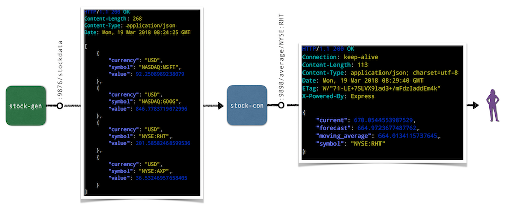

# Developing on Kubernetes—stock market simulator

This repository contains two microservices that make up a stock market simulator application:



One microservice, the so called [stock generator](stock-gen/) is written in Go and serves randomized stock data randomly via the HTTP endpoint `stockdata/`.

A second microservice, the so called [stock consumer](stock-con/) is written in Node.js and consumes the stock data generated by the Go microservice. It serves the following HTTP endpoints: 

1. `average/$SYMBOL` … calculates basic stats of stock symbol `$SYMBOL`
1. `gekko/$SYMBOL` … provides a recommendation like sell/hold/buy for stock symbol `$SYMBOL` (not yet implemented)

An example deployment of the stock market simulator app is available via [dok-stock.k8space.io](http://dok-stock.k8space.io/) and here's an example usage:

```bash
$ http http://dok-stock.k8space.io/average/NYSE:RHT
HTTP/1.1 200 OK
Content-Length: 115
Content-Type: application/json; charset=utf-8
Date: Wed, 14 Mar 2018 09:48:05 GMT
{
    "current": 401.40170157499557,
    "forecast": 531.3260143911555,
    "moving_average": 363.99225782919444,
    "symbol": "NYSE:RHT"
}
```

Note: above output was slightly edited for readability.